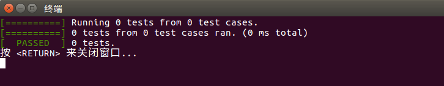
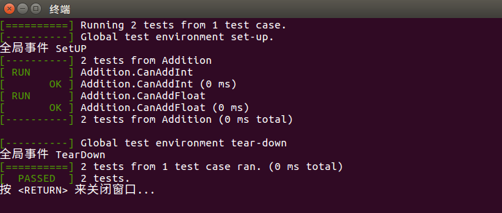
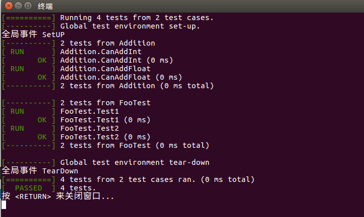
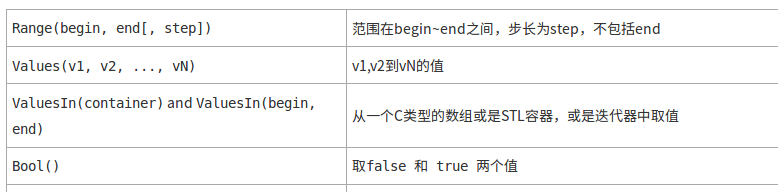
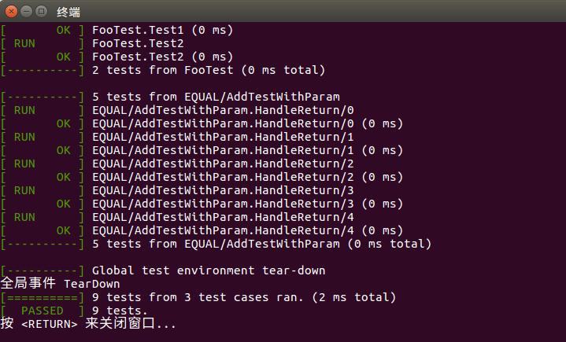
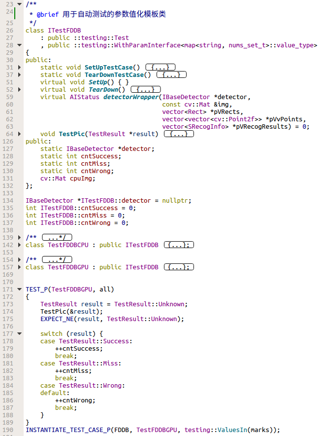
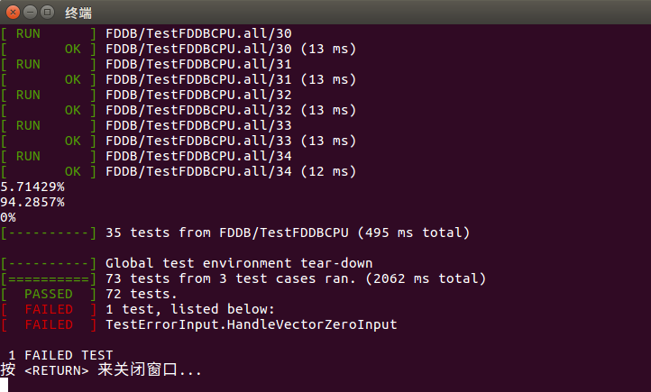

# TDD & googletest


## 一、测试驱动开发 （Test-Driven Development, TDD）


### 1. What ？

TDD 是一种开发方法。它要求在**编写某个功能的代码之前先编写测试代码**，然后只编写使测试通过的功能代码，**通过测试来推动整个开发的进行**。这有助于编写简洁可用和高质量的代码。


**TDD 的实践步骤如下:**

* 首先编写一项无法通过的测试（由于此时尚无功能代码，因此测试会失败）
* 再编写可使其通过的功能代码
* 对初始代码进行重构，直到自己对其设计感到满意


在传统开发实践中，测试始终是中流砥柱，但 TDD 强调的是“测试先行”，而非在开发周期即将结束时才考虑测试。瀑布模型采用的是验收测试（acceptance test），涉及许多人员，通常是大量最终用户（而非开发人员），且该测试发生在代码实际编写完毕之后。如果不将功能覆盖范围作为考虑因素，这种方法看起来的确很好。很多时候，质量保证专业人员仅对他们感兴趣的方面进行测试，而非进行全面测试。


### 2. Why ？

为什么要TDD？ 能够解决什么问题？


**Advantages:**
1）测试即文档，单元测试是不会说谎的文档。
2）测试驱动开发是对开发的限制，如果测试写得好，程序的设计就不会太差，模块的耦合性就不会太强

先写测试对于设计的好处在于，先写测试先定义新的类，以及定义类与类之间的关系，就是在定义类与类之间如何交互，每个类如何暴露自己的接口，类和类之间的引用关系。这时，测试代码会逼迫开发者认真考虑如何分解类与类之间的耦合关系，这样产生的实现代码更容易利用了IoC和DIP的模式，实现面向接口编程。

回头看后写测试的情况，因为从一开始开发者把重心放在实现的细节和功能需求的往复上，对于代码设计、类的关系和定义很容易疏于考虑，产生的结果可能是耦合紧，可测试性差。

3）修改代码的时候会比较有保障

4）编写测试时的过程可以帮助自己理解和细化需求，分解问题，然后逐个覆盖逐个解决，步步为营；


## 3. 哪些工程适合 TDD ？


**需要维护**的代码（Hello World 还有 Demo 不用）

**需求/接口变化比较不频繁** （ 测试也是代码，程序结构变化频繁的时候，测试本身可能不容易维护 ）

业务上没很多关联和耦合 （ 网络请求，读写数据库，虽然可以增加接口进行解耦，但是构建测试上下文的过程会变得比较复杂 ）


## 4. How ?

TDD 在开发中应该如何操作


1） 明确当前要完成的功能。可以记录成一个 TODO 列表。

2） 快速完成针对此功能的测试用例编写。

3） 测试代码编译不通过。

4） 编写对应的功能代码。

5） 测试通过。

6） 对代码进行重构，并保证测试通过。

7） 循环完成所有功能的开发。


## 二、gtest


### 1）简介


#### 1. 相关链接
源码：[github.com/google/googletest](github.com/google/googletest)
文档：[官方文档](github.com/google/googletest/blob/master/googletest/docs/Documentation.md)
教程：[Unit Testing C++ with Google Test - JET BRAINS](blog.jetbrains.com/rscpp/unit-testing-google-test/)


#### 2. Who Is Using Google Test?

In addition to many internal projects at Google, Google Test is also used by the following notable projects:

* The **Chromium** projects (behind the Chrome browser and Chrome OS).
* The **LLVM** compiler.
* **Protocol Buffers**, Google's data interchange format.
* The **OpenCV** computer vision library.
* **tiny-dnn**: header only, dependency-free deep learning framework in C++11.


## 2）


#### 1. Get Started

```cpp
// main.cpp
#include <gtest/gtest.h>

int main(int argc, char* argv[])
{
    testing::InitGoogleTest(&argc, argv);
    return RUN_ALL_TESTS();
}
```


运行结果：



#### 2. TEST 宏  

```cpp
// macro_test.cpp
#include <gtest/gtest.h>

// 定义一个待测试函数
auto add = [](auto a, auto b) { return a + b; };

TEST(Addition, CanAddInt)
{
    EXPECT_EQ(add(2, 2), 4);
}

TEST(Addition, CanAddFloat)
{
    EXPECT_FLOAT_EQ(add(2.4f, 4.2f), 6.6f);
}
```


运行结果：


上面可以看到，编写一个测试案例是多么的简单。  我们使用了TEST这个宏，它有两个参数，官方的对这两个参数的解释为：[TestCaseName，TestName]


#### 3. EXPECT & ASSERT

上面使用到了EXPECT_EQ这个宏，这个宏用来比较两个数字是否相等。Google还包装了一系列EXPECT\_* 和ASSERT\_*的宏，而EXPECT系列和ASSERT系列的区别是： 

1. EXPECT\_*  失败时，案例继续往下执行。 
2. ASSERT\_* 失败时，直接在当前函数中返回，当前函数中ASSERT\_*后面的语句将不会执行。 

| **Fatal assertion** | **Nonfatal assertion** | **Verifies** |
|:--------------------|:-----------------------|:-------------|
| `ASSERT_TRUE(`_condition_`)`;  | `EXPECT_TRUE(`_condition_`)`;   | _condition_ is true |
| `ASSERT_FALSE(`_condition_`)`; | `EXPECT_FALSE(`_condition_`)`;  | _condition_ is false |


| **Fatal assertion**              | **Nonfatal assertion**           | **Verifies**       |
| :------------------------------- | :------------------------------- | :----------------- |
| `ASSERT_EQ(`_val1_`, `_val2_`);` | `EXPECT_EQ(`_val1_`, `_val2_`);` | _val1_ `==` _val2_ |
| `ASSERT_NE(`_val1_`, `_val2_`);` | `EXPECT_NE(`_val1_`, `_val2_`);` | _val1_ `!=` _val2_ |
| `ASSERT_LT(`_val1_`, `_val2_`);` | `EXPECT_LT(`_val1_`, `_val2_`);` | _val1_ `<` _val2_  |
| `ASSERT_LE(`_val1_`, `_val2_`);` | `EXPECT_LE(`_val1_`, `_val2_`);` | _val1_ `<=` _val2_ |
| `ASSERT_GT(`_val1_`, `_val2_`);` | `EXPECT_GT(`_val1_`, `_val2_`);` | _val1_ `>` _val2_  |
| `ASSERT_GE(`_val1_`, `_val2_`);` | `EXPECT_GE(`_val1_`, `_val2_`);` | _val1_ `>=` _val2_ |


字符串比较：
```
ASSERT_STREQ
ASSERT_STRNE
ASSERT_STRCASEEQ
ASSERT_STRCASENE
```


其他：

```
EXPECT_FLOAT_EQ
EXPECT_DEATH
EXPECT_THROW
EXPECT_ANY_THROW
```


#### 4. 宏展开

```bash
g++ -P -E ./macro_test.cpp >> macro_test.i
```

```cpp
#include <gtest/gtest.h>

// 定义一个待测试函数
auto add = [](auto a, auto b) { return a + b; };
class Addition_CanAddInt_Test : public ::testing::Test {
public:
    Addition_CanAddInt_Test() {}
private:
    virtual void TestBody();
    static ::testing::TestInfo* const test_info_ __attribute__ ((unused));
    Addition_CanAddInt_Test(Addition_CanAddInt_Test const &);
    void operator=(Addition_CanAddInt_Test const &);
};

::testing::TestInfo* const Addition_CanAddInt_Test ::test_info_ =
        ::testing::internal::MakeAndRegisterTestInfo(
            "Addition", "CanAddInt", __null, __null,
            ::testing::internal::CodeLocation("./macro_test.cpp", 6),
            (::testing::internal::GetTestTypeId()),
            ::testing::Test::SetUpTestCase,
            ::testing::Test::TearDownTestCase,
            new ::testing::internal::TestFactoryImpl< Addition_CanAddInt_Test>);

void Addition_CanAddInt_Test::TestBody()
{
    switch (0)
    case 0:
    default:
        if (const ::testing::AssertionResult gtest_ar =
                (::testing::internal:: EqHelper<
                 (sizeof(::testing::internal::IsNullLiteralHelper(add(2, 2))) == 1)>
                 ::Compare("add(2, 2)", "4", add(2, 2), 4)))
            ;
        else
            ::testing::internal::AssertHelper(
                    ::testing::TestPartResult::kNonFatalFailure,
                    "./macro_test.cpp", 8,
                    gtest_ar.failure_message()) = ::testing::Message();
}

class Addition_CanAddFloat_Test : public ::testing::Test {
public:
    Addition_CanAddFloat_Test() {}
private:
    virtual void TestBody();
    static ::testing::TestInfo* const test_info_ __attribute__ ((unused));
    Addition_CanAddFloat_Test(Addition_CanAddFloat_Test const &);
    void operator=(Addition_CanAddFloat_Test const &);
};

::testing::TestInfo* const Addition_CanAddFloat_Test ::test_info_ = ::testing::internal::MakeAndRegisterTestInfo( "Addition", "CanAddFloat", __null, __null, ::testing::internal::CodeLocation("./macro_test.cpp", 11), (::testing::internal::GetTestTypeId()), ::testing::Test::SetUpTestCase, ::testing::Test::TearDownTestCase, new ::testing::internal::TestFactoryImpl< Addition_CanAddFloat_Test>);void Addition_CanAddFloat_Test::TestBody()
{
    switch (0) case 0: default: if (const ::testing::AssertionResult gtest_ar = (::testing::internal::CmpHelperFloatingPointEQ<float>("add(2.4f, 4.2f)", "6.6f", add(2.4f, 4.2f), 6.6f))) ; else ::testing::internal::AssertHelper(::testing::TestPartResult::kNonFatalFailure, "./macro_test.cpp", 13, gtest_ar.failure_message()) = ::testing::Message();
}

```


#### 5. 全局事件

```cpp
#include <iostream>
#include <gtest/gtest.h>

class FooEnvironment
        : public testing::Environment {
public:
    virtual void SetUp() {
        std::cout << "全局事件 SetUP" << std::endl;
    }
    virtual void TearDown() {
        std::cout << "全局事件 TearDown" << std::endl;
    }
};

int main(int argc, char* argv[])
{
    // 注册全局事件
    testing::AddGlobalTestEnvironment(new FooEnvironment);

    testing::InitGoogleTest(&argc, argv);
    return RUN_ALL_TESTS();
}
```


要实现全局事件，必须写一个类，继承 **testing::Environment** 类，实现里面的 *SetUp* 和 *TearDown* 方法。

1. SetUp() 方法在所有案例执行前执行
2. TearDown() 方法在所有案例执行后执行


运行结果：




#### 6. TEST_F 宏

```cpp
// macro_test_f.cpp
#include <gtest/gtest.h>

class FooTest :
        public testing::Test {
public:
    static void SetUpTestCase() {}
    static void TearDownTestCase() {}
    virtual void SetUp() {}
    virtual void TearDown() {}
};

TEST_F(FooTest, Test1)
{
}

TEST_F(FooTest, Test2)
{
}
```


我们需要写一个类，继承 **testing::Test**，然后实现两组方法

1. SetUpTestCase() 方法在 TestCase 开始前执行
2. TearDownTestCase() 方法在 TestCase 结束后执行
3. SetUp()方法在每个 Test 之前执行
4. TearDown()方法在每个 Test 之后执行


运行结果：




#### 7. TEST_P 宏 （参数化）


```cpp
// macro_test_p.cpp
#include <gtest/gtest.h>

auto add = [](auto a, auto b) { return a + b; };

class AddTestWithParam
    : public ::testing::Test
    , public ::testing::WithParamInterface<int>
{
};

TEST_P(AddTestWithParam, HandleReturn)
{
    int n = GetParam();
    EXPECT_EQ(add(n, 10), n + 10);
}

INSTANTIATE_TEST_CASE_P(EQUAL,
                        AddTestWithParam,
                        testing::Values(3, 5, 11, 23, 17));
```


**INSTANTIATE_TEST_CASE_P**

  第一个参数是测试案例的前缀，可以任意取。 

  第二个参数是测试案例的名称，需要和之前定义的参数化的类的名称相同，如：IsPrimeParamTest 

  第三个参数是可以理解为参数生成器，上面的例子使用test::Values表示使用括号内的参数。Google提供了一系列的参数生成的函数：




运行结果：




#### 8. 应用


定接口

```cpp
virtual AIStatus detect(
    const cv::Mat& imgSrc,
    vector<Rect> *pVRects,
    vector<vector<cv::Point2f>> *pVvPoints=NULL,
    vector<SRecogInfo> *pVRecogResults=NULL) = 0;
```


FDDB 人脸标注

```
2002_07_28_big_img_416.jpg
3
60.933903 44.468305 -1.530098 98.276900 82.268230  1
52.564676 35.774346 -1.460712 321.103651 63.475043  1
23.958142 18.064426 1.553739 364.859591 103.521632  1
2002_08_07_big_img_1393.jpg
2
163.745742 109.136126 1.236962 132.225074 172.180404  1
134.196339 96.693777 -1.276447 204.178610 271.741124  1
2002_08_26_big_img_292.jpg
1
163.778521 101.169600 1.543931 148.203875 181.913193  1
2002_08_26_big_img_301.jpg
1
166.948740 108.322300 1.377403 144.199819 197.377459  1
2003_01_13_big_img_195.jpg
1
81.043000 62.000000 -1.298475 187.311671 101.154428  1
2002_07_26_big_img_532.jpg
9
51.889492 33.394627 -1.502245 245.113481 133.696345  1
54.576501 38.488467 1.527672 181.971806 82.479070  1
49.398518 29.843745 1.437926 98.197429 59.428833  1
47.648948 28.245858 1.513057 6.655783 36.699163  1
44.437752 30.284679 -1.478244 40.422777 13.905788  1
49.143573 31.955262 1.550535 135.210922 50.421439  1
38.724294 30.275047 1.479142 268.345804 14.771547  1
46.233421 29.684012 1.498761 279.356598 62.823034  1
57.401922 30.723317 1.405984 450.000000 194.870692  1
2002_08_20_big_img_550.jpg
...
...
```


定义存储结构

```cpp
/**
 * @brief 存储 FDDB 人脸标注的数据类型
 */
using nums_t = std::tuple<float, float, float, float, float, int>;

/**
 * @brief 一幅图片中所有人脸
 */
using nums_set_t = std::set<nums_t>;

```


存标注文档信息的容器

```cpp
std::map<std::string, nums_set_t> marks;
```


定义转换函数和检测函数

```cpp
/**
 * @brief 将 FDDB 标注文档的数据转换为 cv::Rect 类型
 *
 * @param nums
 * @return cv::Rect
 */
cv::Rect toCVRect(const nums_t &nums)
{
    float ra = std::get<0>(nums);
    float rb = std::get<1>(nums);
    float cx = std::get<3>(nums);
    float cy = std::get<4>(nums);
    return cv::Rect(cx - ra, cy - rb, 2 * ra, 2 * rb);
}

/**
 * @brief 计算 IoU
 *
 * @param lhs
 * @param rhs
 * @return T 区间[0, 1]范围内的值
 */
template <typename T>
T IoU(const cv::Rect &lhs, const cv::Rect &rhs)
{
    auto areaOfIntersection = (T)((lhs & rhs).area());
    return areaOfIntersection / (lhs.area() + rhs.area() - areaOfIntersection);
}
```





运行结果：

